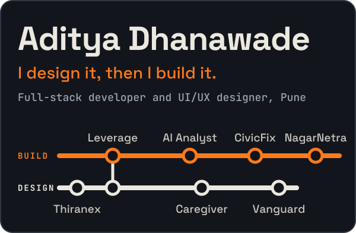
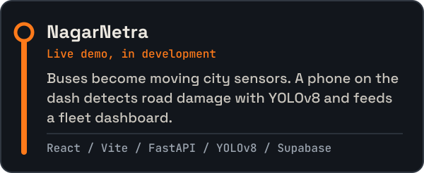
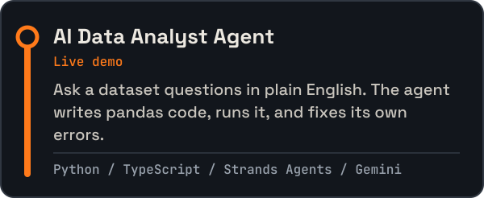
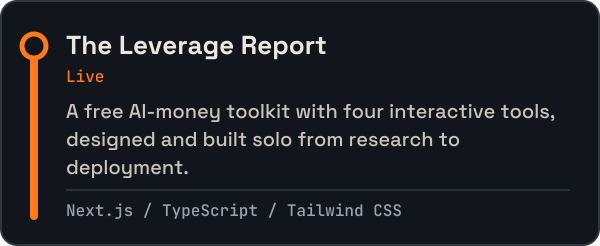
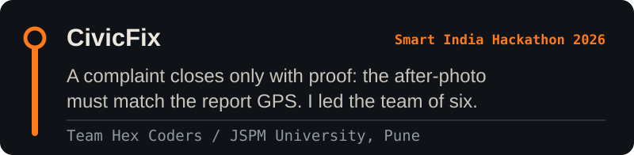
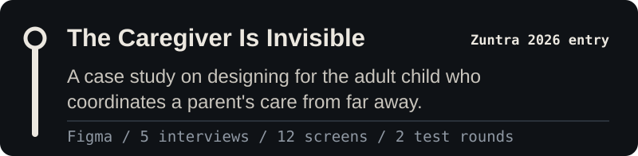
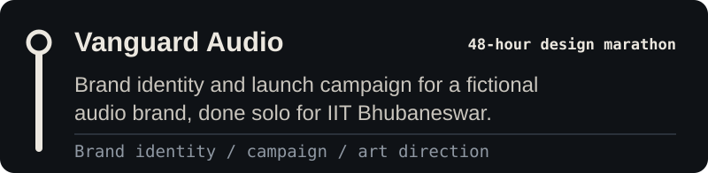
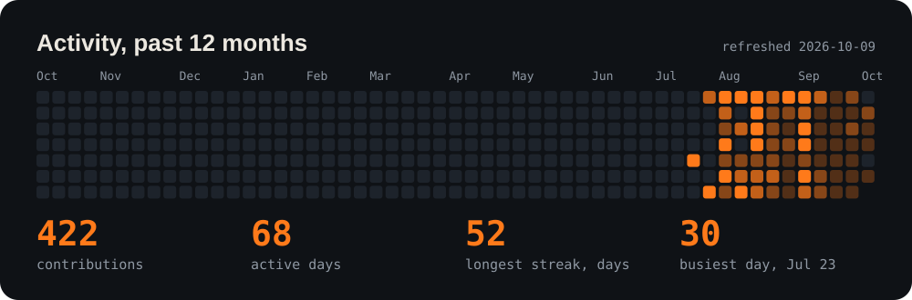
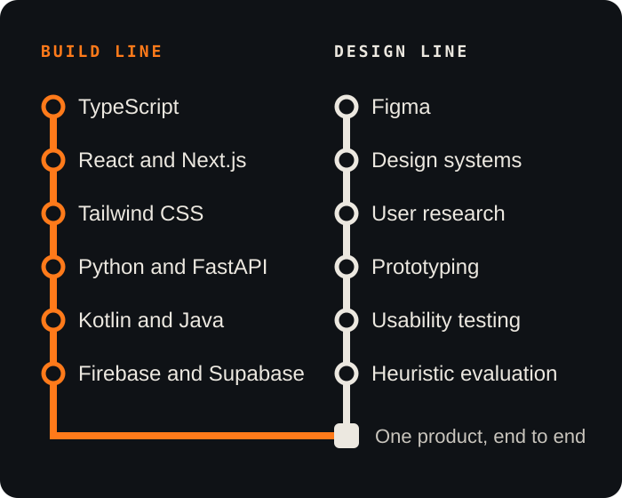
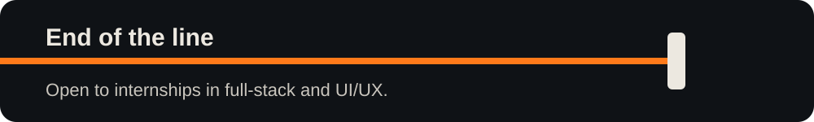

 

Third-year B.Tech CSE student in Pune. I take a product from user research through design to a deployed build, so the interface and the code come from the same person.

[LinkedIn](https://www.linkedin.com/in/aditya-dhanawade-07004a317/) · [Email](mailto:avdhanawade94@gmail.com) · [The Leverage Report](https://theleveragereport.me)

## Projects

Every project is a stop on one of two lines. Orange is build work, cream is design work.

### Build line

[Live demo](https://nagarnetra-dun.vercel.app) · [Code](https://github.com/adityadhanawade/nagarnetra)

[Live demo](https://ai-data-analyst-agent-snowy.vercel.app) · [Code](https://github.com/adityadhanawade/ai-data-analyst-agent) · The backend sleeps on a free tier, so the first request can take up to a minute.

[Live site](https://theleveragereport.me) · [Code](https://github.com/adityadhanawade/leverage-report-website)

[Repository](https://github.com/adityadhanawade/CivicFix-SIH2026)

### Design line

[Case study](https://github.com/adityadhanawade/the-caregiver-is-invisible)

[Submission](https://github.com/adityadhanawade/vanguard-audio-design-marathon)

**Other stops:** [UI/UX internship at Thiranex](https://github.com/adityadhanawade/uiux-internship-thiranex) (wireframes, a heuristic redesign, moderated usability testing) · [Vehicle Automation App](https://github.com/adityadhanawade/vehicle-automation-app) (Kotlin and Java, built with three classmates) · [Portfolio site](https://github.com/adityadhanawade/adityadhanawade.github.io)

## Activity

Drawn from public contribution data by a small script, redrawn every Monday by [a workflow](.github/workflows/refresh-activity.yml).

## Toolkit

 

Every graphic here is generated by [`scripts/build_assets.py`](scripts/build_assets.py). Edit the script, run it, commit the SVGs.
